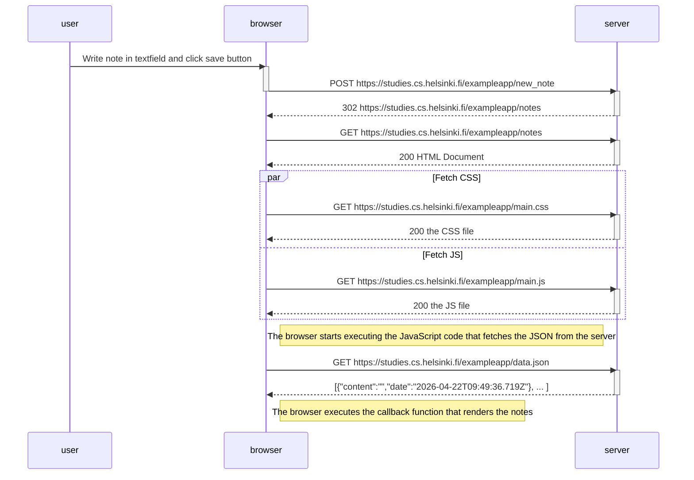

```mermaid
sequenceDiagram
    participant user
    participant browser
    participant server

    user->>browser: Write note in textfield and click save button
    activate browser
    browser->>server: POST https://studies.cs.helsinki.fi/exampleapp/new_note
    deactivate browser

    activate server
    server-->>browser: 302 https://studies.cs.helsinki.fi/exampleapp/notes
    deactivate server

    browser->>server: GET https://studies.cs.helsinki.fi/exampleapp/notes
    activate server
    server-->>browser: 200 HTML Document
    deactivate server

    par Fetch CSS
        browser->>server: GET https://studies.cs.helsinki.fi/exampleapp/main.css
        activate server
        server-->>browser: 200 the CSS file
        deactivate server
    and Fetch JS
        browser->>server: GET https://studies.cs.helsinki.fi/exampleapp/main.js
        activate server
        server-->>browser: 200 the JS file
        deactivate server
    end

    Note right of browser: The browser starts executing the JavaScript code that fetches the JSON from the server

    browser->>server: GET https://studies.cs.helsinki.fi/exampleapp/data.json
    activate server
    server-->>browser: [{"content":"","date":"2026-04-22T09:49:36.719Z"}, ... ]
    deactivate server

    Note right of browser: The browser executes the callback function that renders the notes
```