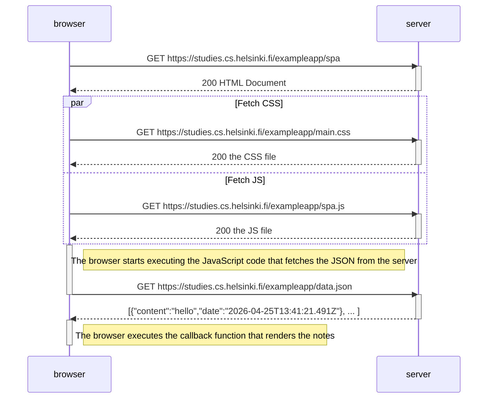

```mermaid
sequenceDiagram
    participant browser
    participant server

    browser->>server: GET https://studies.cs.helsinki.fi/exampleapp/spa

    activate server
    server-->>browser: 200 HTML Document
    deactivate server

    par Fetch CSS
        browser->>server: GET https://studies.cs.helsinki.fi/exampleapp/main.css
        activate server
        server-->>browser: 200 the CSS file
        deactivate server
    and Fetch JS
        browser->>server: GET https://studies.cs.helsinki.fi/exampleapp/spa.js
        activate server
        server-->>browser: 200 the JS file
        deactivate server
    end
    activate browser
    Note right of browser: The browser starts executing the JavaScript code that fetches the JSON from the server

    browser->>server: GET https://studies.cs.helsinki.fi/exampleapp/data.json
    deactivate browser
    activate server
    server-->>browser: [{"content":"hello","date":"2026-04-25T13:41:21.491Z"}, ... ]
    deactivate server
    activate browser
    Note right of browser: The browser executes the callback function that renders the notes
    deactivate browser
```