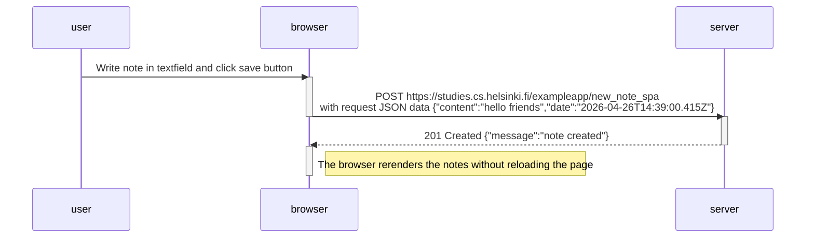

```mermaid
sequenceDiagram
    participant user
    participant browser
    participant server

    user->>browser: Write note in textfield and click save button

    activate browser
    browser->>server: POST https://studies.cs.helsinki.fi/exampleapp/new_note_spa <br/> with request JSON data {"content":"hello friends","date":"2026-04-26T14:39:00.415Z"}
    deactivate browser

    activate server
    server-->>browser: 201 Created {"message":"note created"}
    deactivate server

    activate browser
    Note right of browser: The browser rerenders the notes without reloading the page
    deactivate browser
```